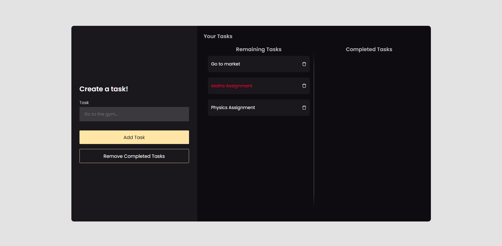
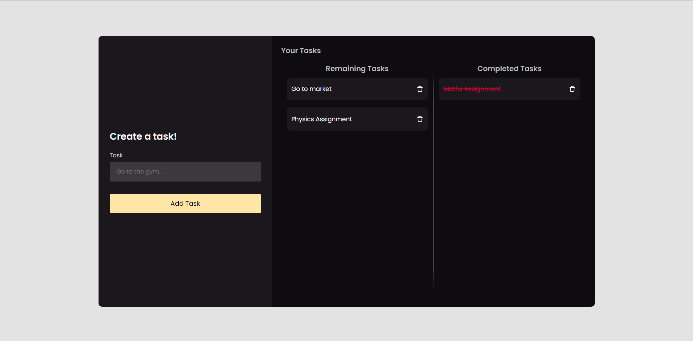

# Todo App

<br>
<br>

<p align="center">
  <a href="https://galk-todo.vercel.app/">
    
  </a>
</p>

<br/>
<br/>

**Demo** : [Click here](https://galk-todo.vercel.app/)


<br/>

### **Installation**

1. Clone the client repository 
   ```sh
   git clone https://github.com/ayushyadav9/GALK-lab-assignment
   ```

2. Install all npm packages from package.json
   ```sh
   npm install
   ```

3. Run the react app
    ```sh
    npm start
    ```
4. App will be runing at http://localhost:3000

<br/>


<!-- USAGE EXAMPLES -->
## **Screenshots**
<div align="center" ><br/>
Adding a Task<br/><hr width=600/>
  <br/><br/>
Removing the task to Completed List<br/><hr width=600/>
  <br/><br/>
</div>
<br/>

